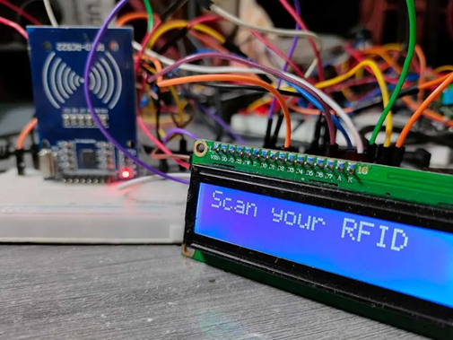
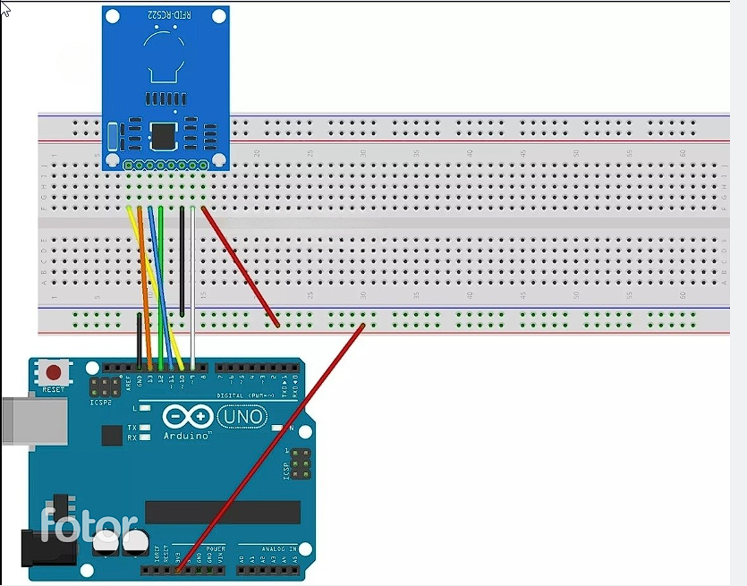
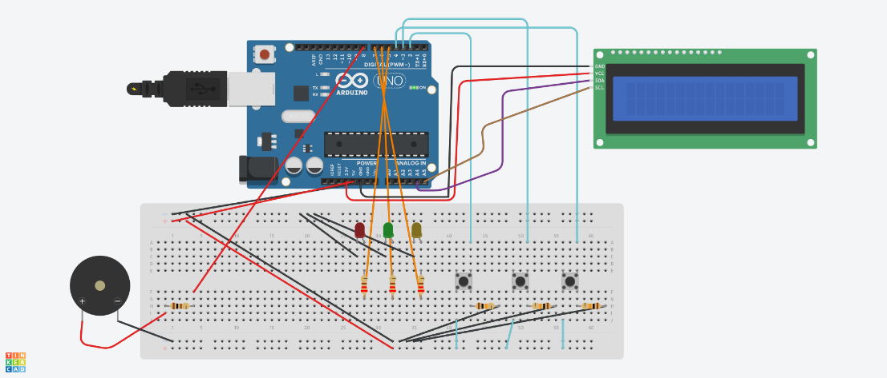
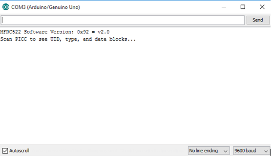
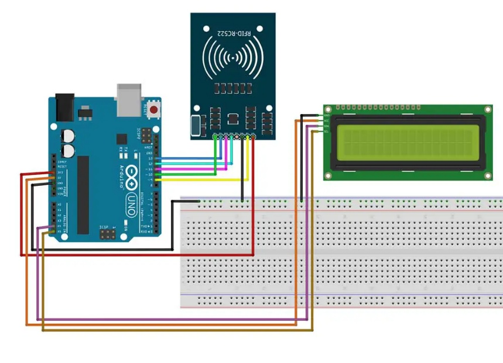
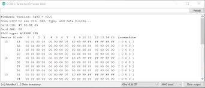
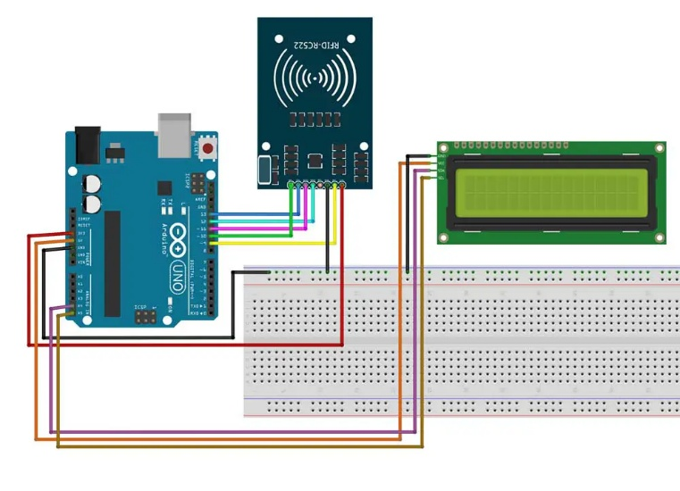

# RFID Cloner using Arduino UNO & RC522



A hardware-based RFID cloner built with an **Arduino UNO** and the **RC522 (MFRC522) RFID reader module**, designed to read, analyze, and duplicate 13.56 MHz MIFARE Classic card data — while demonstrating just how weak the security of low-cost RFID access systems really is.

> Built as a final-year academic project (B.Sc. Advanced Networking & Cyber Security, Brainware University) by **Amit Roy, Arpan Chakraborty, Adrija Goswami, and Subhadip Parua**.

---

## ⚠️ Disclaimer

This project is for **educational and security research purposes only**. It demonstrates known vulnerabilities in MIFARE Classic / low-cost RFID access systems (weak CRYPTO1 encryption, UID-only authentication, default keys). Only test this on cards and systems you own or have explicit permission to test. The authors are not responsible for any misuse.

---

## 📖 Overview

RFID technology is everywhere — office badges, hostel/campus ID cards, transit passes, gate access systems — but many of these still rely on cheap 13.56 MHz MIFARE Classic cards that authenticate using nothing more than a UID and a factory-default key. This project builds a working reader/writer to:

- Scan a card and extract its **UID** and memory block data
- Display real-time status on a **16×2 I2C LCD**
- Write the captured data onto a blank/writable target card (clone)
- Simulate a basic **access control** flow (granted/denied) with LED + buzzer feedback
- Document and demonstrate the underlying security weaknesses of these systems

---

## ✨ Features

- 🔍 Read RFID card UID and sector/block data via SPI
- 📋 Live output on Serial Monitor (hex UID, auth status, block reads/writes)
- 🖥️ Real-time status messages on 16×2 I2C LCD (`Scan Card`, `Access Granted`, `Clone Successful`, etc.)
- 🟢🔴 LED indicators (green = granted, red = denied, yellow = processing) + buzzer feedback
- 🧬 Full card cloning: reads a source card and writes its data to a target card
- 🔐 Built-in security analysis of MIFARE Classic vulnerabilities (see below)

---

## 🛠️ Hardware Used

| Component | Purpose |
|---|---|
| Arduino UNO (ATmega328P) | Main controller |
| RC522 (MFRC522) RFID Reader Module | 13.56 MHz MIFARE read/write |
| 16×2 I2C LCD (PCF8574 backpack) | Status/UID display |
| Red / Yellow / Green LEDs | Access status indicators |
| Buzzer | Audio feedback |
| Push buttons | Mode selection (read / clone / verify) |
| Breadboard + jumper wires | Prototyping |
| MIFARE Classic 1K cards/tags | Source + target cards |

### Wiring — RC522 to Arduino UNO (SPI)

| RC522 Pin | Arduino UNO Pin | Function |
|---|---|---|
| SDA / SS | D10 | Slave Select |
| SCK | D13 | Serial Clock |
| MOSI | D11 | Master Out, Slave In |
| MISO | D12 | Master In, Slave Out |
| RST | D9 | Reset |
| VCC | **3.3V** | Power (never 5V!) |
| GND | GND | Common ground |

### Wiring — I2C LCD

| LCD Pin | Arduino UNO Pin |
|---|---|
| VCC | 5V |
| GND | GND |
| SDA | A4 |
| SCL | A5 |

> ⚠️ **Never power the RC522 with 5V** — it only tolerates 3.3V and can be permanently damaged otherwise.

---

## 🔌 Circuit Diagrams

**Basic RC522 ↔ Arduino wiring**



**Full system — RC522, LCD, LEDs, buzzer, and push buttons**



---

## ⚙️ How It Works

1. Arduino powers up and initializes SPI (RC522) and I2C (LCD)
2. LCD shows `Scan Card` — system waits for a card in range
3. RC522 generates a 13.56 MHz RF field; a passive card entering it gets powered via inductive coupling
4. The card returns its UID/data via backscatter modulation
5. Arduino reads the data over SPI and either:
   - Compares the UID for **access control**, or
   - Reads block data for **cloning**, then authenticates and writes it to a target card
6. LCD, LEDs, and buzzer show the result (`Access Granted` / `Access Denied` / `Clone Successful`)
7. System resets and returns to scan mode

---

## 📸 Screenshots

**System ready — waiting for a card**


**UID read on Serial Monitor**



**Card cloning in progress**



**Cloning steps on Serial Monitor** — authentication → block read → block write → clone confirmed



**LCD showing access result**



---

## 📁 Repository Structure

```
rfid-cloner/
├── DumpInfo/
│   └── rfidClonerCode/     # Arduino sketches (.ino) for reading/cloning cards
├── intro/                  # Setup / getting-started sketches
└── Brainware ID card UID.txt   # Sample captured UID dump
```

---

## 🚀 Getting Started

1. Install the [Arduino IDE](https://www.arduino.cc/en/software)
2. Install the required libraries via **Sketch → Include Library → Manage Libraries**:
   - `MFRC522` by Miguel Balboa (RC522 driver)
   - `LiquidCrystal_I2C` (or `New-LiquidCrystal`) for the I2C LCD
3. Wire the hardware as described above
4. Open the sketch from `DumpInfo/rfidClonerCode/`, select **Arduino UNO** as the board, and upload
5. Open the Serial Monitor at **9600 baud**
6. Place a card near the RC522 to read its UID, or follow the on-screen prompts to clone a card

---

## 🔐 Security Analysis

This project also demonstrates why MIFARE Classic cards are considered insecure for serious access-control use:

- **Weak encryption** — relies on the reverse-engineered CRYPTO1 cipher
- **UID-only authentication** — many systems check nothing but a UID, which is trivial to read and duplicate
- **Default keys** — factory keys (e.g. `FF FF FF FF FF FF`) are rarely changed in real deployments
- **No mutual authentication** — the card verifies the reader, but not vice versa, enabling rogue readers
- **Susceptible to replay and relay (MITM) attacks**

**Recommended mitigations:** encrypted cards (MIFARE DESFire EV1/EV2 with AES), multi-factor authentication, backend/server-side verification, and anti-cloning mechanisms like rolling codes or challenge-response authentication.

---

## 🧭 Limitations

- Short read range (~2–5 cm), typical of the RC522
- No AES/advanced encryption implemented in this build
- Standalone system — no backend server or centralized logging
- Not suitable for high-security deployments (banking, defense, etc.)

## 🔮 Future Scope

- Migrate to encrypted cards (MIFARE DESFire / NTAG) with AES
- Add PIN/biometric multi-factor authentication
- IoT integration (ESP8266/ESP32) for cloud logging and remote monitoring
- Anti-cloning detection via rolling codes / dynamic keys
- Companion mobile app for access logs and virtual card emulation

---

## 📚 References

- Klaus Finkenzeller, *RFID Handbook: Fundamentals and Applications in Contactless Smart Cards and Radio Frequency Identification*, 3rd Edition, Wiley
- NXP Semiconductors, *MFRC522 Contactless Reader IC Datasheet*
- Arduino S.r.l., *Arduino UNO Rev3 — Technical Specifications*
- ISO/IEC 14443, *Identification Cards — Contactless Integrated Circuit Cards*
- Juels, A., *RFID Security and Privacy: A Research Survey*, IEEE

---

## 👥 Authors

- Amit Roy
- Arpan Chakraborty
- Adrija Goswami
- Subhadip Parua

Department of Cyber Science & Technology, Brainware University

## 📄 License

No license specified yet — consider adding one (e.g. MIT) if you want others to freely reuse this code.
